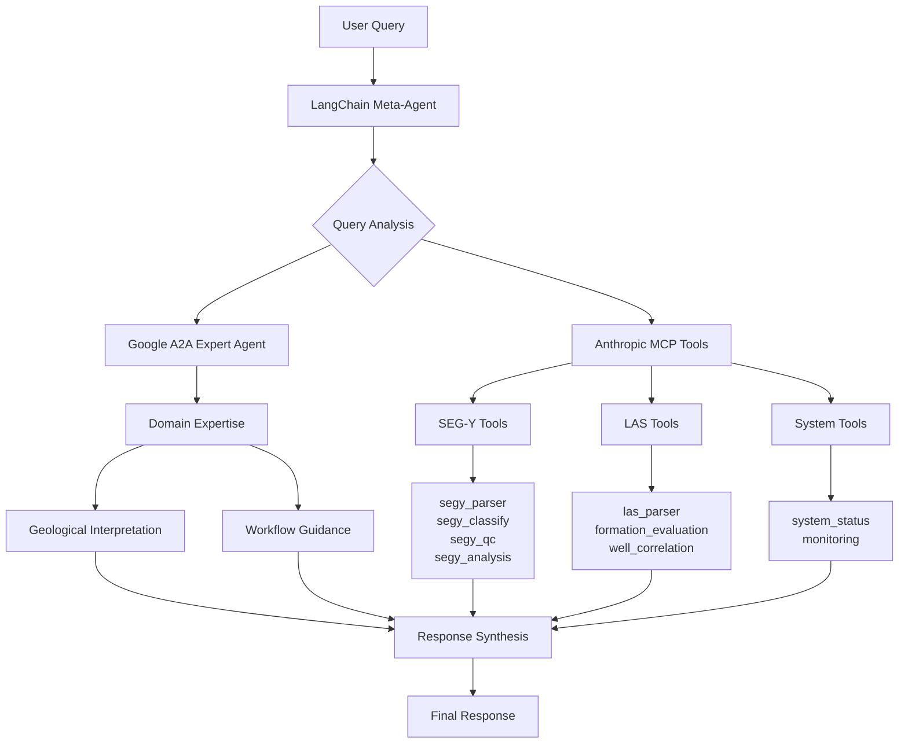

# AgentNexus: Subsurface Agentic Framework 🌊
**Multi-agent AI framework for geophysical data analysis powered by Google A2A and Anthropic MCP**

Agentic framework integrating SEG-Y seismic analysis and LAS well log evaluation with intelligent agent orchestration and professional-grade geological insights.

---

## 🌟 Features

### Core Capabilities
🔍 **Multi-Format Support** - SEG-Y seismic files and LAS well logs  
📊 **Intelligent Analysis** - Survey classification, quality control, and formation evaluation  
🔗 **Data Integration** - Well-to-seismic correlation and multi-file processing  
🛡️ **Quality Assurance** - Automated validation with industry-standard thresholds  
🧠 **AI Expertise** - Natural language geological interpretation and workflow guidance  
📈 **Advanced Analytics** - Dynamic range analysis, geometry mapping, and petrophysical calculations  

### AI Agentic Architecture
**Google Agent-to-Agent (A2A)** - Specialized subsurface data interpretation expert agent  
**Anthropic Model Context Protocol (MCP)** - 16 standardized tool integrations  
**LangChain Orchestration** - Intelligent multi-agent workflow coordination  

---

## 🚀 Quick Start

```bash
# Setup
git clone https://github.com/mivaa-admin/mivaa-agentnexus.git
cd mivaa-agentnexus
python -m venv .venv && source .venv/bin/activate
pip install -r requirements.txt
echo "OPENAI_API_KEY=your_key" > .env

# Run
python main.py

# Example queries
> What metadata is in survey_3d.sgy?
> Classify the survey type for Model94_shots.segy
> Analyze all SEG-Y files and recommend processing sequence
> Correlate all wells matching field_*.las
> What's the best workflow for processing these shot gather files?
```

---

## 🛠️ Available MCP Tools (16 Total)

### SEG-Y Seismic Analysis Tools (8)
| Tool | Purpose | Example Usage |
|------|---------|---------------|
| **segy_parser** | Comprehensive metadata extraction | Parse survey_3d.sgy and extract geometry |
| **segy_classify** | Survey type classification | Classify Model94_shots.segy - 2D or 3D? |
| **segy_qc** | Quality control analysis | Check quality of seismic_data.sgy |
| **segy_analysis** | Geometry and characteristics | Analyze survey geometry of marine_2d.sgy |
| **segy_template_detect** | Automated template detection | Detect optimal template for shots.sgy |
| **segy_survey_compare** | Multi-file compatibility | Compare F3 files for processing compatibility |
| **segy_survey_analysis** | Multi-file survey analysis | Process all matching 3D_*.sgy files |
| **quick_segy_summary** | Fast file inventory | Summarize all SEG-Y files in directory |

### LAS Well Log Analysis Tools (7)
| Tool | Purpose | Example Usage |
|------|---------|---------------|
| **las_parser** | Extract metadata & curves | Parse all matching well_*.las |
| **las_analysis** | Statistical curve analysis | Analyze GR and RHOB curves in well_1.las |
| **las_qc** | Data validation | Check quality of problematic_well.las |
| **formation_evaluation** | Petrophysical analysis | Evaluate formation in reservoir.las |
| **well_correlation** | Multi-well correlation | Correlate formations across field_*.las |
| **calculate_shale_volume** | Gamma ray shale volume | Calculate shale volume using Larionov |
| **list_files** | File inventory | List all LAS files matching pattern |

### System Management Tools (1)
| Tool | Purpose | Example Usage |
|------|---------|---------------|
| **system_status** | Health monitoring | What is current system performance? |

---

## 📋 Command Examples

### SEG-Y Seismic Analysis
```bash
# File operations
> Give me a quick summary of all SEG-Y files
> Process all files matching *shots*.segy in parallel

# Survey classification & geometry
> Classify the survey type for 1997_shots.segy - 2D or 3D?
> Analyze the survey geometry of F3_subvolume.sgy
> Detect the optimal template for Model94_shots.segy

# Quality control & comparison
> Check quality of 3X_75_PR.SGY and identify issues
> Compare characteristics of all F3 files for compatibility
> Analyze all SEG-Y files and recommend optimal processing sequence

# Expert consultation
> What's the best workflow for processing shot gather files?
> How do these F3 subvolumes relate in terms of processing requirements?
```

### LAS Well Log Analysis
```bash
# Formation evaluation  
> Evaluate all matching reservoir_*.las
> Calculate net pay thickness using 10% porosity cutoff
> What does high resistivity with low porosity indicate?

# Multi-well analysis
> Correlate all wells matching field_*
> Find formation tops across multiple wells
> Which well shows thickest reservoir section?

# Expert interpretation
> How do I identify tight gas sands in logs?
> Recommend completion strategy for these results
```

### System Management
```bash
# System monitoring
> What is current system health and performance?
> List all available tools and their status
```

---

## 🔧 Configuration

### Environment Setup (.env)
```bash
OPENAI_API_KEY=your_openai_api_key  # Required
DATA_DIR=./data                     # Optional
LOG_FORMAT=csv                      # csv|json|text
```

### Command Line Options
```bash
python main.py --data-dir ./data --model gpt-4o --debug
```

---

## 🏗️ Agentic Framework Architecture

### Data Flow & Query Processing



### Agent Responsibilities

#### 🎯 **LangChain Meta-Agent (Orchestrator)**
**Role**: Query analysis, agent coordination, and response synthesis
- **Input Processing**: Parses user queries and determines analysis requirements
- **Agent Selection**: Routes queries to appropriate specialized agents and tools
- **Workflow Orchestration**: Manages multi-step analysis workflows
- **Response Integration**: Synthesizes results from multiple agents into coherent answers

#### 🧠 **Google A2A Expert Agent (Technical Specialist)**
**Role**: Technical guidance and workflow recommendations
- **Data Characterization**: Provides technical analysis of file properties
- **Quality Evaluation**: Applies industry-standard assessment criteria  
- **Workflow Guidance**: Recommends processing sequences based on data characteristics
- **Technical Consultation**: Answers questions about file formats and processing methods

#### 🛠️ **Anthropic MCP Tools (Execution Layer)**
**Role**: Data processing and analysis execution
- **File Processing**: Handles SEG-Y and LAS file parsing and validation
- **Technical Analysis**: Performs calculations, quality control, and data extraction
- **Batch Operations**: Executes multi-file processing workflows
- **System Monitoring**: Tracks performance and health metrics

### Data Analysis & Processing

#### **SEG-Y Seismic File Processing**
Built on **segyio** - the industry-standard Python library for SEG-Y file access:
- **Native Header Reading**: Direct access to trace headers without template files
- **Memory-Efficient Processing**: Handles large seismic volumes (tested up to 1.9 GB files)
- **Format Compliance**: Supports SEG-Y Rev 0, Rev 1, and Rev 2 specifications
- **Trace Data Access**: Efficient reading of seismic amplitudes and metadata

**Technical Capabilities**:
- Survey geometry extraction (inline/crossline ranges, coordinate systems)
- Data format detection (IBM float, IEEE float, integer formats)
- Quality metrics calculation (dynamic range, signal-to-noise ratios)
- Survey classification (2D/3D, prestack/poststack, sorting methods)

#### **LAS Well Log File Processing**  
Built on **lasio** - the standard Python library for LAS file handling:
- **Robust Parsing**: Handles LAS 1.2, 2.0, and 3.0 format specifications
- **Curve Data Access**: Extraction of log curves with proper null value handling
- **Header Information**: Well metadata, curve definitions, and parameter sections
- **Error Recovery**: Manages problematic files with encoding and formatting issues

**Technical Capabilities**:
- Petrophysical calculations (porosity, water saturation, net pay)
- Formation evaluation using industry-standard equations (Archie's, Larionov)
- Multi-well correlation algorithms with formation top identification
- Data quality assessment and validation protocols

### Analysis Approach

#### **Factual Data Processing**
- **Metadata Extraction**: Direct reading of file headers and technical specifications
- **Statistical Analysis**: Calculation of amplitude statistics, trace counts, and data ranges
- **Quality Metrics**: Objective assessment using industry-standard thresholds
- **Format Validation**: Verification of file structure and data integrity

#### **Conservative Interpretation**
- **Survey Classification**: Based on trace organization patterns and header analysis
- **Quality Assessment**: Uses established industry criteria for data evaluation
- **Workflow Recommendations**: Follows proven geophysical processing sequences
- **Technical Guidance**: Provides factual information about data characteristics

#### **No Geological Interpretation**
The framework focuses on:
- **Data characterization** rather than geological conclusions
- **Technical analysis** of file properties and quality
- **Processing recommendations** based on data characteristics
- **Workflow guidance** for handling different survey types

**Note**: The system provides technical analysis and data characterization. Geological and structural interpretation should be performed by qualified geoscientists using appropriate interpretation software and domain expertise.

### Server Architecture

#### **Dual-Server Design**
```
┌─────────────────────┐    ┌─────────────────────┐
│   A2A Server        │    │   MCP Server        │
│   Port: 5000        │    │   Port: 7000        │
│                     │    │                     │
│ ┌─────────────────┐ │    │ ┌─────────────────┐ │
│ │ WellLogExpert   │ │    │ │ 16 MCP Tools    │ │
│ │ Agent           │ │    │ │                 │ │
│ │                 │ │    │ │ SEG-Y: 8 tools  │ │
│ │ - Domain Logic  │ │    │ │ LAS: 7 tools    │ │
│ │ - Interpretation│ │    │ │ System: 1 tool  │ │
│ │ - Consultation  │ │    │ │                 │ │
│ └─────────────────┘ │    │ └─────────────────┘ │
└─────────────────────┘    └─────────────────────┘
           │                           │
           └─────────┬─────────────────┘
                     │
           ┌─────────────────────┐
           │   LangChain        │
           │   Meta-Agent       │
           │                    │
           │ - Query Routing    │
           │ - Agent Coord      │
           │ - Response Synth   │
           └─────────────────────┘
```

### Advanced Workflow Examples

#### **Complex Multi-Agent Query**: "Process all shot files and recommend optimal sequence"

```
1. Meta-Agent Analysis:
   ├── Identifies batch processing requirement
   ├── Plans multi-file workflow
   └── Coordinates parallel execution

2. A2A Expert Consultation:
   ├── Defines quality criteria for shot data
   ├── Establishes processing priorities
   └── Provides workflow recommendations

3. MCP Tools Execution:
   ├── quick_segy_summary: File inventory
   ├── segy_classify: Survey type detection
   ├── segy_qc: Quality assessment
   └── segy_survey_compare: Compatibility analysis

4. Response Synthesis:
   ├── Technical metrics from tools
   ├── Expert recommendations from A2A
   └── Prioritized processing sequence
```

#### **Expert Consultation**: "What's the best workflow for processing these files?"

```
1. Meta-Agent: Routes to A2A Expert for workflow guidance
2. A2A Expert: 
   ├── Analyzes file characteristics
   ├── Applies industry best practices
   └── Provides step-by-step recommendations
3. Meta-Agent: Formats expert guidance for user
```

### Performance Optimization

#### **Intelligent Routing**
- **Simple queries** → Direct MCP tool execution
- **Complex analysis** → Multi-agent coordination
- **Expert questions** → A2A agent consultation
- **Batch operations** → Parallel tool execution

#### **Caching & Efficiency**
- **File metadata caching** for repeated queries
- **Agent response optimization** for similar questions
- **Tool result reuse** for multi-step workflows

---

---

## 📁 Project Structure

```
mivaa-agentnexus/
├── 📄 main.py                           # Application entry point
├── 📄 __init__.py                       # Package initialization
├── 📄 requirements.txt                  # Python dependencies
├── 📄 LICENSE                          # MIT License
├── 📄 README.md                        # Documentation
├── 📄 .env                             # Environment variables
├── 📄 app.log                          # Application logs
│
├── 🔧 Core Framework Components
├── 📄 enhanced_mcp_tools.py            # MCP tool implementations
├── 📄 robust_las_parser.py             # LAS file parsing with lasio
├── 📄 formation_evaluation.py          # Petrophysical calculations
├── 📄 well_correlation.py              # Multi-well analysis algorithms
├── 📄 result_classes.py                # Data structure definitions
│
├── 🌊 SEG-Y Processing Suite
├── 📄 production_segy_tools.py         # Core segyio-based parsing
├── 📄 production_segy_analysis.py      # Geometry and survey analysis
├── 📄 production_segy_analysis_qc.py   # Quality control assessment
├── 📄 production_segy_monitoring.py    # Performance monitoring
├── 📄 production_segy_multifile.py     # Batch processing workflows
├── 📄 survey_classifier.py             # Survey type classification
│
├── 🧪 Testing & Validation
├── 📄 comprehensive_test_script.py     # Framework testing suite
├── 📄 test_openai_api_key_validity.py  # API connectivity tests
├── 📄 example_agent_questions_list.txt # Query examples
├── 📄 segyio_transformation_test_results.json # Test results
│
├── 📁 Directories
├── 📂 .venv/                           # Python virtual environment
├── 📂 config/                          # Configuration files
├── 📂 data/                            # SEG-Y and LAS data files
├── 📂 logs/                            # Analysis logs and monitoring
├── 📂 monitoring/                      # Performance metrics
└── 📂 templates/                       # SEG-Y template files
```

### File Descriptions

#### **Core Framework**
- **main.py** - Application entry point with agent orchestration
- **enhanced_mcp_tools.py** - 16 MCP tool implementations for SEG-Y and LAS analysis
- **result_classes.py** - Data structures and response formatting

#### **LAS Processing (lasio-based)**
- **robust_las_parser.py** - LAS file parsing with error recovery using lasio
- **formation_evaluation.py** - Petrophysical calculations (Archie's equation, Larionov)
- **well_correlation.py** - Multi-well correlation and formation top detection

#### **SEG-Y Processing (segyio-based)**
- **production_segy_tools.py** - Core SEG-Y parsing and metadata extraction
- **production_segy_analysis.py** - Survey geometry and trace analysis
- **production_segy_analysis_qc.py** - Quality control with industry thresholds
- **production_segy_monitoring.py** - Real-time performance monitoring
- **production_segy_multifile.py** - Batch processing and multi-file workflows
- **survey_classifier.py** - Intelligent survey type classification (2D/3D detection)

#### **Testing & Validation**
- **comprehensive_test_script.py** - Complete framework testing suite
- **test_openai_api_key_validity.py** - API connectivity validation
- **example_agent_questions_list.txt** - Sample queries for testing
- **segyio_transformation_test_results.json** - Test result archive

#### **Configuration & Data**
- **.env** - Environment variables (API keys, data paths)
- **config/** - YAML configuration files for tools and processing
- **data/** - SEG-Y and LAS data files for analysis
- **logs/** - Analysis logs and Q&A interaction history
- **monitoring/** - Performance metrics and health check data
- **templates/** - SEG-Y template files (auto-generated by segyio)

---

## 📈 Use Cases

### Geophysicists & Data Analysts
- **Seismic Data Characterization** - Technical analysis of survey geometry and file properties
- **Multi-file Processing** - Batch analysis with compatibility evaluation using segyio
- **Quality Assessment** - Objective evaluation using industry-standard metrics
- **Processing Workflows** - Technical recommendations based on data characteristics

### Reservoir Engineers  
- **Formation Evaluation** - Petrophysical calculations using established equations
- **Log Analysis** - Curve processing and statistical analysis with lasio
- **Data Integration** - Technical correlation between well and seismic data formats

### Well Log Analysts
- **LAS File Processing** - Robust parsing and validation using lasio
- **Curve Analysis** - Statistical evaluation and quality assessment
- **Multi-well Analysis** - Technical correlation based on log characteristics

### Data Management Teams
- **Quality Assurance** - Automated validation for both SEG-Y and LAS file formats
- **Batch Processing** - Efficient analysis of large datasets
- **Performance Monitoring** - System health and processing metrics tracking

---

## 🤝 Contributing

```bash
# Development setup
git clone -b develop https://github.com/mivaa-admin/mivaa-agentnexus.git
pip install -r requirements-dev.txt
python -m pytest tests/
```

**Guidelines**: Follow PEP 8, add docstrings, include tests, update docs.

---

## 📄 License & Support

- **License**: MIT License
- **Issues**: [GitHub Issues](https://github.com/mivaa-admin/mivaa-agentnexus/issues)
- **Discussions**: [GitHub Discussions](https://github.com/mivaa-admin/mivaa-agentnexus/discussions)

---

## 🙏 Acknowledgments

Built with **Google A2A**, **Anthropic MCP**, **segyio**, **lasio**, **LangChain**, **FastMCP**, and **OpenAI**.

**Technical framework for geophysical data analysis and processing workflows** 🎯

*Production-ready agentic framework providing technical analysis of geophysical data formats using industry-standard libraries.*